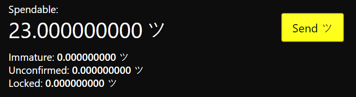

{ width=350 }

 

- **Spendable:** Coins that are available to send.
- **Immature:** Awaiting for more confirmation in the blockchain. By default, once 10 confirmations (blocks) are reached these funds will be considered spendable.
- **Unconfirmed:** Funds that your wallet is expeting to receive, but have not appeared in a block yet. *e.g.* when the sender hasn't finalized the transaction yet.
- **Locked:** The coins you use as inputs in a transaction will be shown as locked from the 1~st~ step of interaction and until it is confirmed. To free them up for use again, you can just cancel the transaction.

!!! note ""
    Sometimes when receiving grin, your balance may be out of sync. Therefore, if it's not showing up in the wallet, please
    { width=80, isplay="inline" }
    the node (it will take a some time).
