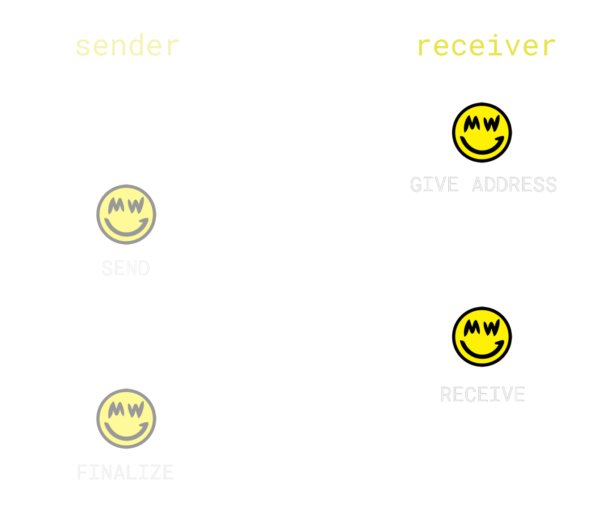
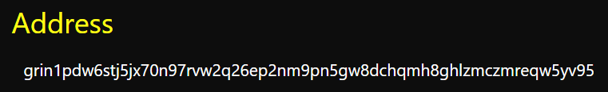
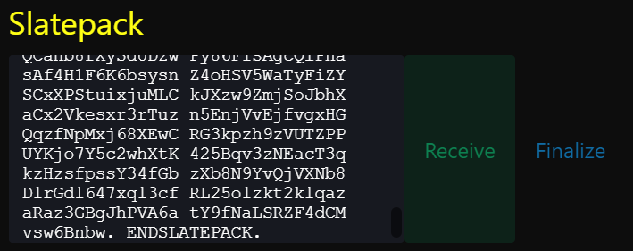
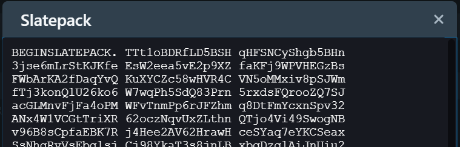
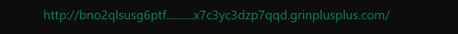

{ width=400 }

Grin transactions are interactive, meaning both parties need to build the transaction together. There are three ways to do so; Tor, Slatepacks or HTTP.

---

## Tor

Steps:

- Provide address.

{ width=350 }

That's it! This address tells the sender's wallet how to contact you via Tor. The transaction should **automatically** complete if both your wallets are up.

The same interaction happens as pictured above, but it all happens instantly and does not require any other manual steps.

If you or the sender don't have Tor accessible (or wallet isn't currently running), then slatepacks will be used;

---

## Slatepacks

These are encrypted text messages which contain transaction data, and should be exchanged back-and-forth in whatever way suits you both.

Steps:

- Provide address.

{ width=350 }

*If Tor connection is not successful:*

- Copy-paste the sender's slatepack and choose 'Receive'.

{ width=350 }

- Give the new slatepack to the sender. Wait for them to finalize.

{ width=350 }

---

## HTTP (Exchanges)

Steps:

- Provide HTTP address.

{ width=350 }

Most exchanges don't support the new transaction flow yet, and thus require an incoming HTTP connection to withdraw. Grin++ makes this process much easier by providing an address that relays those transactions directly to your wallet.

!!! note "Kucoin"
    When trying to withdraw from Kucoin, replace it with `http://<youraddress>.grincoins.com`.

Once Grin has its final hardfork in Jan 2021, the HTTP transaction method will be removed.
