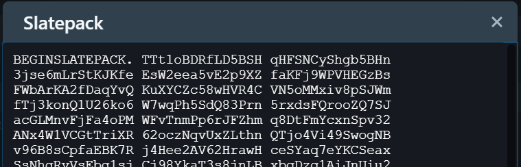
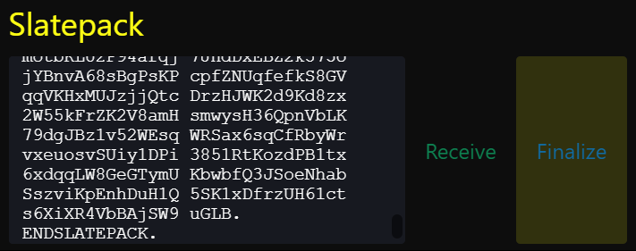

{ width=380 }

Grin transactions are interactive, meaning both parties need to build the transaction together. There are three ways to do so; Tor, Slatepacks or HTTP.

---

## Tor / HTTP

As the sender, sending via Tor or HTTP is the same process; Simply send to the address you were provided with, and Grin++ will recognize its type.

Steps:

- Send to address.

{ width=350 }

If the receiver's wallet wasn't reachable, then slatepacks will be used;

---

## Slatepacks

Steps:

- Send to address.

{ width=350 }

*If Tor or HTTP connections are not successful:*

- Provide the slatepack to the receiver (by chat, e-mail etc).

{ width=350 }

- Copy-paste the receiver's slatepack and choose 'Finalize'.

{ width=350 }

Done ツ
