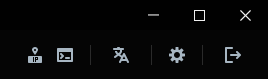
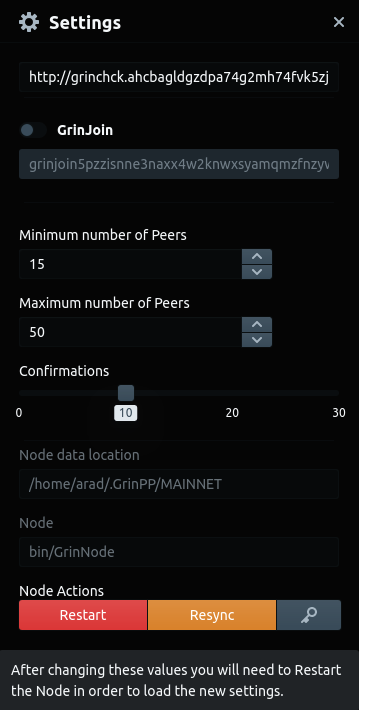
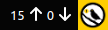

&dArr; &dArr; &dArr;

{ align=left }

### **Settings**

`grinchck` onion website lets you check whether an HTTP address is reachable. Regular website is [grnchck.uber.space](https://grinchck.uber.space/)

**GrinJoin** is a transaction aggregation service for extra privacy. Currently disabled.

**Peers** are other nodes which your Grin++ node talks to and exchanges data with. There's no need to adjust it.

**Confirmations** are the number of blocks after which a received transaction is considered spendable. Setting this to a higher number effectively protects against chain re-orgs.

**Node data location** is where the blockchain data is stored. Note that it's a hidden folder.

**Restart** and apply setting changes.

**Resync** the entire chain from scratch. Useful when funds seem to be missing.

🔑 Shows the wallet seed phrase.

### Extra

- ⬆️ Outbound peers.

- ⬇️ Inbound peers. Requires [opening port 3414](https://forum.grin.mw/t/how-to-open-port-3414-and-why/7825) and generally benefits the Grin network.

- 🦜 [Warrant canary](https://en.wikipedia.org/wiki/Warrant_canary). If this is ever missing in a Grin++ release, assume the worst.

 
