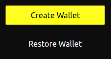

## Download

Visit [https://grinplusplus.github.io/](https://grinplusplus.github.io/)

Click 'Download' and then execute Grin++. It's as simple as that.

!!! note ""
    If you recently used Niffler wallet, then first kill the grin process running in the background.

## Setup wallet

Your full node is syncing the blockchain, and you can create a wallet in the meantime.

{ width=150 }

### Create a new wallet

Grin++ allows you to create several different wallets, completely seperated from each other.

Create a wallet and make sure to write down the seed phrase on paper and **store it safely**. It's the only way to restore your funds if anything ever happens to your wallet data (hard-drive crash, file corruption, accidental deletion etc).

Double check you wrote the phrase correctly!

### Restore a wallet

To restore a grin wallet, you'll have to wait for the node to finish syncing.

When it's done, you can enter your seed phrase and Grin++ will scan the blockchain for all funds that belong to you.
